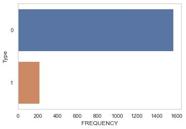
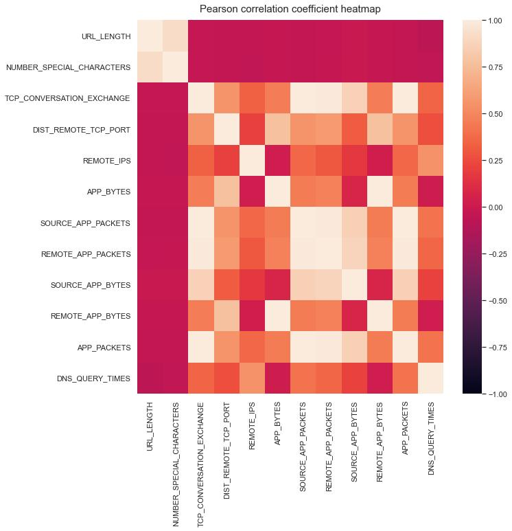
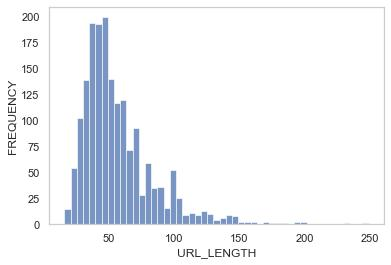
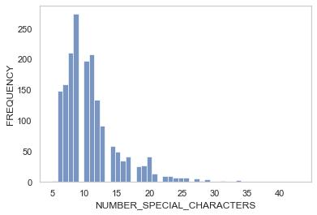
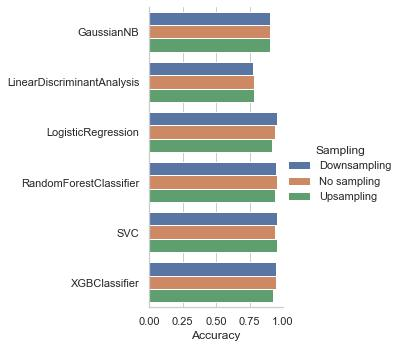
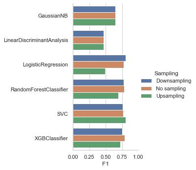
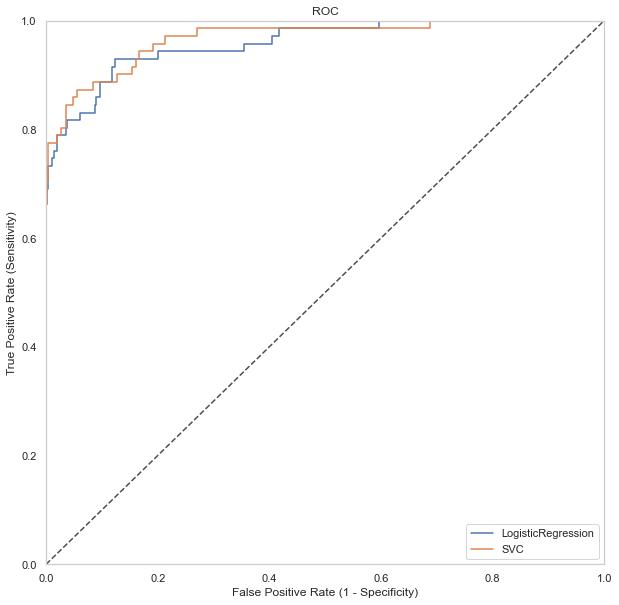

# Malicious URL Detection

This repository is for the analysis and modeling done with the malicious and benign websites dataset. Below you will find an overview of the data, code, and results.

Over 70% of all system intrusion breaches involve malware, and 32% of all malware is distributed via the web. The average cost of a data breach for an organization like IBM is 4.24 million dollars. Given the rise of remote work due to COVID-19, developing more efficient detection systems is imperative.

### Project Outcome

The models I chose were due to their potential to handle an imbalanced dataset. The dataset I used consisted of 12.1% malicious URLS and 87.9% benign. I chose models which have the ability to adjust prior probabilities, change class weights, or have a tunable cost parameter. I also tried downsampling and upsampling while tuning the parameters with cross-validation.

## Exploratory Data Analysis, Data Cleaning, and Feature Engineering

During my exploratory data analysis, I cleaned and feature engineered the data in the following ways:
* Fixed `CHARSET` to be uniformly uppercase and set "None" to NaN
* Set values of "b", "0", and "None" in the date columns `WHOIS_REGDATE` and `WHOIS_UPDATED_DATE` to NaN
* Parsed date columns which contained different date formats
* Created new time feature by seperating time from date
* Created five new date features using datetime to extract day of year, day of month, day of week, weekend, and working day
* Seperated `SERVER` column into a binary matrix for each type of server using regular expressions
* Removed server versions and non-server entries  
* Set "None" and "\[U'GB'; U'UK']" in `WHOIS_COUNTRY` column to NaN and "UK", respectively
* Standardized `WHOIS_COUNTRY` column to country abbreviations from mix of country abbreviations and full names using a dictionary
* Set "None", "P", "Not Applicable", random symbols, countries, email, and "Other" in `WHOIS_STATE` to NaN 
* Standardized `WHOSIS_STATE` column to state abbreviations from mix of state abbreviations, full names, and zip codes using a dictionary

Figures 1 through 4 are some of the highlights from my exploratory data analysis.

<figure>
 
  <figcaption>Figure 1: Distribution of malicious (1) and benign (0) websites.</figcaption>
</figure>
  

<figure>
 
  <figcaption>Figure 2: Pearson correlation coefficient heatmap for numerical variables.</figcaption>
</figure>
  

<figure>
 
  <figcaption>Figure 3: Distribution of URL length.</figcaption>
</figure>
  

<figure>
 
  <figcaption>Figure 4: Distribution of number of special characters used in URL.</figcaption>
</figure>
  

## Data Splitting, Feature Scaling, and Data Imputation

I split the data using stratified sampling on the malicious/bengin categorical variable (i.e., Type) with the training set getting 2/3 of the data and test set getting 1/3. I then created a pipeline that uses SimpleImputer and OneHotEncoder for categorical variables, and Simple Imputer and StandardScaler for numerical variables. For one subset of categorical variables (country and state), I chose to impute using the constant "UNAVAILABLE" because I thought that malicious websites might try to hide their country and state which is why it might be missing. For the rest of the categorical variables, I imputed with "most_frequent." For the numerical variables, I imputed with the feature's median value. Median was chosen to avoid excess influence by outliers had mean been chosen. The exploratory data analysis revealed that many of the numerical variables were right skewed. In the future, I may return to the imputation part of this project and experiment with different types of imputation to optimize imputation using cross-validation scores.

## Modeling Building

I chose models that might be effective against the imbalanced dataset. They have the ability to adjust prior probabilities, change class weights, or have a tunable cost parameter. In addition to having these qualities, I chose three non-flexible models (GaussianNB, LinearDiscriminantAnalysis, and LogisticRegression) and three flexible models (RandomForestClassifier, SVC, and XGBClassifier). I expected that the best performing model should come from the flexible model group and I would use that model's performance to compare the simpler models with. Should any of the simpler models have comparable performance then I could use that model due to easier interpretability. To evaluate the models I used five-fold cross validation. I tried three different tactics for training the models: upsampling, downsampling, and no sampling. For upsampling and downsampling, for each of the five folds I split the data into the training set and validation set then either upsampled or downsampled the training set. I upsampled the minority class (i.e., malicious website) or downsampled the majority class (i.e., benign website). These three different scenarios (upsampling, downsampling, and no sampling) were performed in three different py scripts. These sampling methods were deployed to help counteract the imbalanced dataset.

## Model Performance

The models were evaluated using several metrics, but primarily with F1. Accuracy is not a good metric by itself due to the imbalanced dataset. Randomly guessing that every website is benign would yield an accuracy of 87.9%. Recall is important, because a false negative would result in the exposure to a malicious website. However, randomly guessing that every site is malicious would yield a perfect recall score, but an accuracy of 12.1% (it would also be very annoying to the user to have every website blocked). Precision also has the same issue as recall. ROC AUC is not a good metric for imbalanced datasets, because it's possible to have a high AUC, but low precision. Area under the precision-recall curve is more suitable for imbalanced datasets than ROC AUC. A balance between precision and recall is needed to ensure a balance between the reduction of false positives and false negatives. For this reason, F1 was chosen as the scoring metric. The models (with their best parameters) were evaluated with the test set and recall, precision, accuracy, F1, ROC AUC, and precision-recall AUC were calculated. The results are shown in Figures 5 through 10.

<figure>
 
  <figcaption>Figure 5: Recall scores per model using non-sampled, downsampled, and upsampled training data.</figcaption>
</figure>
  

<figure>
 
  <figcaption>Figure 6: Precision scores per model using non-sampled, downsampled, and upsampled training data.</figcaption>
</figure>
  

<figure>
 
  <figcaption>Figure 7: Accuracy scores per model using non-sampled, downsampled, and upsampled training data.</figcaption>
</figure>
  

<figure>
 
  <figcaption>Figure 8: F1 scores per model using non-sampled, downsampled, and upsampled training data.</figcaption>
</figure>
  

<figure>
 
  <figcaption>Figure 9: ROC AUC scores per model using non-sampled, downsampled, and upsampled training data.</figcaption>
</figure>
  

<figure>
 
  <figcaption>Figure 10: PR AUC scores per model using non-sampled, downsampled, and upsampled training data.</figcaption>
</figure>
  

Using F1 scores, the best flexible model was the upsampled SVC and best non-flexible model was the upsampled LogisticRegression. Their metrics are shown in the table below.

| Model              | Recall      | Precision   | F1          | Accuracy    | ROC AUC     | Precision-Recall AUC     |
|     -----------    | ----------- | ----------- | ----------- | ----------- | ----------- | ----------- |
| LogisticRegression | 0.789       | 0.848       | 0.818       | 0.957       | 0.882       | 0.882       |
| SVC                | 0.775       | 0.948       | 0.853       | 0.968       | 0.898       | 0.898       |

Below is the ROC AUC plot to compare the LogisticRegression and SVC models.

<figure>
 
  <figcaption>Figure 10: ROC for LogisticRegression and SVC.</figcaption>
</figure>
  

## Future Work

I am currently building an anomoly detection system using this dataset. The py file is code/anomaly_detection_system.py.

## Resources

1. [Malicious and benign websites dataset](https://www.kaggle.com/datasets/xwolf12/malicious-and-benign-websites)
2. [A stacking model using URL and HTML features for phishing webpage detection](https://www.sciencedirect.com/science/article/abs/pii/S0167739X1830503X)
3. [Malicious URL Detection Based on Associative Classification](https://www.ncbi.nlm.nih.gov/pmc/articles/PMC7911559/)
4. [Intelligent phishing url detection using association rule mining](https://hcis-journal.springeropen.com/articles/10.1186/s13673-016-0064-3#:~:text=(4)-,Association%20rule%20mining%20to%20detect%20phishing%20URL,when%20a%20user%20accesses%20it.)
5. Applied Predictive Modeling by Max Kuhn and Kjell Johnson
6. [Upsampling and Downsampling Imbalanced Data in Python](https://wellsr.com/python/upsampling-and-downsampling-imbalanced-data-in-python/)
7. [ROC Curves and Precision-Recall Curves for Imbalanced Classification](https://machinelearningmastery.com/roc-curves-and-precision-recall-curves-for-imbalanced-classification/)
