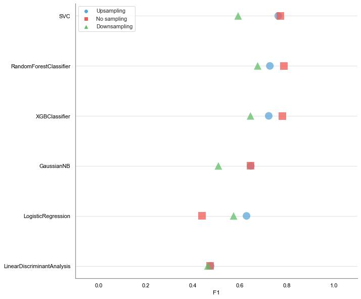
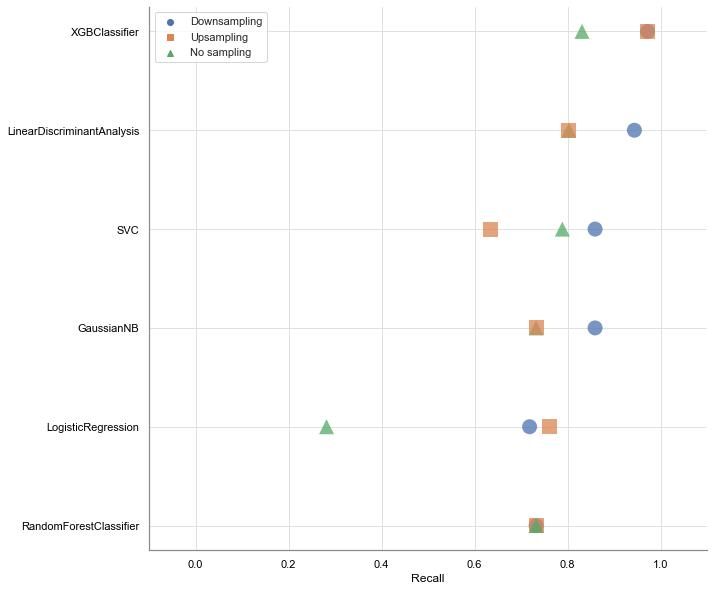
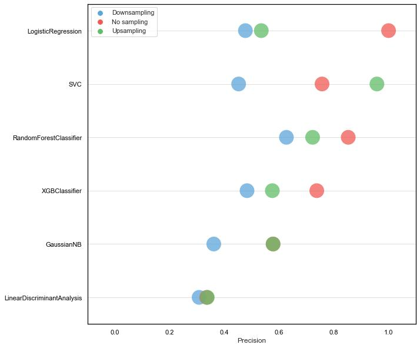
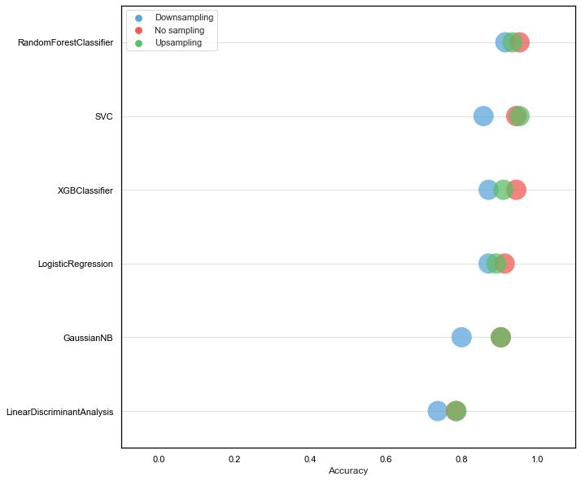

# malicious-url-detection

<figure>
 
  <figcaption>Figure 1: Strip plot of F1 scores per model using non-sampled, downsampled, and upsampled training data.</figcaption>
</figure>
  

<figure>
 
  <figcaption>Figure 2: Strip plot of recall scores per model using non-sampled, downsampled, and upsampled training data.</figcaption>
</figure>
  

<figure>
 
  <figcaption>Figure 3: Strip plot of precision scores per model using non-sampled, downsampled, and upsampled training data.</figcaption>
</figure>
  

<figure>
 
  <figcaption>Figure 4: Strip plot of accuracy scores per model using non-sampled, downsampled, and upsampled training data.</figcaption>
</figure>
  

<figure>
 
  <figcaption>Figure 5: Strip plot of ROC AUC per model using non-sampled, downsampled, and upsampled training data.</figcaption>
</figure>
  

<figure>
 
  <figcaption>Figure 6: Strip plot of precision-recall AUC per model using non-sampled, downsampled, and upsampled training data.</figcaption>
</figure>
  

