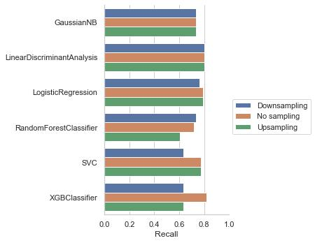
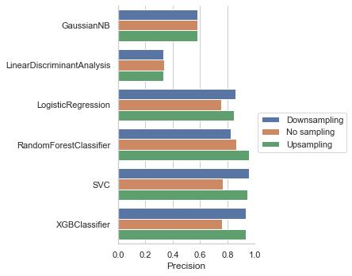
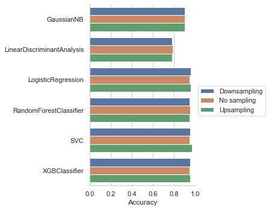
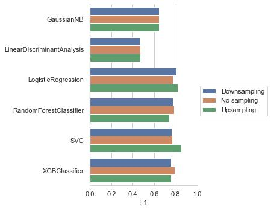

# Malicious URL Detection

This repository is for the analysis and modeling done with the malicious and benign websites dataset. Below you will find an overview of the data, code, and results.

Over 70% of all system intrusion breaches involve malware, and 32% of all malware is distributed via the web. The average cost of a data breach for an organization like IBM is 4.24 million dollars. Given the rise of remote work due to COVID-19, developing more efficient detection systems is imperative.

### Project Outcome

The models I chose were due to their potential to handle an imbalanced dataset. The dataset I used consisted of 12.1% malicious URLS and 87.9% benign. I chose models which have the ability to adjust prior probabilities, change class weights, or have a tunable cost parameter. I also tried downsampling and upsampling while tuning the parameters with cross-validation.

## Data Cleaning

## Exploratory Data Analysis

## Feature Engineering

## Modeling Building

I split the data using stratified sampling on the malicious/bengin categorical variable (i.e., Type) with the training set getting 2/3 of the data and test set getting 1/3. I chose models that might be effective against the imbalanced dataset. They have the ability to adjust prior probabilities, change class weights, or have a tunable cost parameter. In addition to having these qualities, I chose three non-flexible models (GaussianNB, LinearDiscriminantAnalysis, and LogisticRegression) and three flexible models (RandomForestClassifier, SVC, and XGBClassifier). I expected that the best performing model should come from the flexible model group and I would use that model's performance to compare the simpler models with. Should any of the simpler models have comparable performance then I could use that model to explore variable importance due to easier interpretability. To evaluate the models I used five-fold cross validation. I tried three different tactics for training the models: upsampling, downsampling, and no sampling. For upsampling and downsampling, for each of the five folds I split the data into the training set and validation set then either upsampled or downsampled the training set. I upsampled the minority class (i.e., malicious website) or downsampled the majority class (i.e., benign website). These three different scenarios (upsampling, downsampling, and no sampling) were performed in three different py scripts. These sampling methods were deployed to help counteract the imbalanced dataset.

## Model Performance

The models were evaluated using several metrics. Accuracy is not a good metric due to the imbalanced dataset. Randomly guessing that every website is benign would yield an accuracy of 87.9%. Recall is important, because a false negative would result in the exposure to a malicious website. However, randomly guessing that every site is malicious would yield a perfect recall score, but an accuracy of 12.1% (it would also be very annoying to the user to have every website blocked). Therefore, a balance between precision and recall is needed. For this reason, F1 was chosen as the scoring metric. The model with their best parameters were evaluated with the test set and recall, precision, accuracy, F1, and ROC AUC were calculated. The results are shown in Figures 1 through 5.

<figure>
 
  <figcaption>Figure 1: Recall scores per model using non-sampled, downsampled, and upsampled training data.</figcaption>
</figure>
  

<figure>
 
  <figcaption>Figure 2: Precision scores per model using non-sampled, downsampled, and upsampled training data.</figcaption>
</figure>
  

<figure>
 
  <figcaption>Figure 3: Accuracy scores per model using non-sampled, downsampled, and upsampled training data.</figcaption>
</figure>
  

<figure>
 
  <figcaption>Figure 4: F1 scores per model using non-sampled, downsampled, and upsampled training data.</figcaption>
</figure>
  

<figure>
 
  <figcaption>Figure 5: ROC AUC scores per model using non-sampled, downsampled, and upsampled training data.</figcaption>
</figure>
  

## Resources

1. [Malicious and benign websites dataset](https://www.kaggle.com/datasets/xwolf12/malicious-and-benign-websites)
2. [A stacking model using URL and HTML features for phishing webpage detection](https://www.sciencedirect.com/science/article/abs/pii/S0167739X1830503X)
3. [Malicious URL Detection Based on Associative Classification](https://www.ncbi.nlm.nih.gov/pmc/articles/PMC7911559/)
4. [Intelligent phishing url detection using association rule mining](https://hcis-journal.springeropen.com/articles/10.1186/s13673-016-0064-3#:~:text=(4)-,Association%20rule%20mining%20to%20detect%20phishing%20URL,when%20a%20user%20accesses%20it.)
5. Applied Predictive Modeling by Max Kuhn and Kjell Johnson
6. [Upsampling and Downsampling Imbalanced Data in Python](https://wellsr.com/python/upsampling-and-downsampling-imbalanced-data-in-python/)
7. [ROC Curves and Precision-Recall Curves for Imbalanced Classification](https://machinelearningmastery.com/roc-curves-and-precision-recall-curves-for-imbalanced-classification/)
